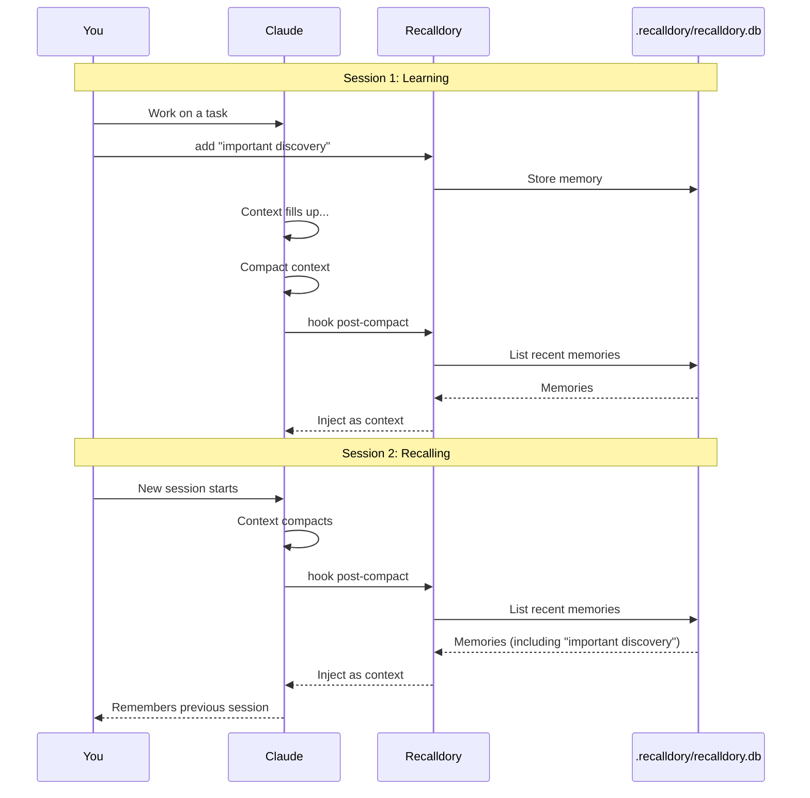

# `recalldory`

A learning memory system for AI coding assistants - curated by you, persisted across sessions. Written in [Inko](https://inko-lang.org/).

Named after **Dory**, the blue tang from *Finding Nemo* known for her short-term memory loss. Irony aside, `recalldory` helps AI assistants remember context across sessions, something Dory could only dream of. Just keep swimming, just keep recalling.

## Mental Model

**You curate, recalldory persists.**

Adding memories is always manual - you decide what's worth remembering. Retrieval is automatic after context compaction via hooks; otherwise manual via `recall`. This explicit curation avoids the noise of LLM-generated "important" memories.

## Workflow



## Installation

### Install script (recommended)

```bash
curl -fsSL https://raw.githubusercontent.com/jhult/recalldory/trunk/install.sh | bash
```

This downloads the latest binary for your platform, installs the Claude Code skill to `~/.claude/skills/recalldory/`, adds `~/.local/bin` to your PATH (if needed), and runs `recalldory hook install`. Re-running upgrades to the latest version.

Options: `--prefix DIR` (default: `~/.local`), `--target TARGET` (override platform detection), `--skip-hook`, `--skip-skill`.

### Manual download

Download the latest release for your platform from the [Releases page](https://github.com/jhult/recalldory/releases).

| Binary | Platform |
|--------|----------|
| `recalldory-amd64-linux-gnu` | Linux x86_64 (glibc) |
| `recalldory-arm64-linux-gnu` | Linux ARM64 (glibc) |
| `recalldory-amd64-linux-musl` | Linux x86_64 (musl/Alpine) |
| `recalldory-arm64-linux-musl` | Linux ARM64 (musl/Alpine) |
| `recalldory-amd64-mac-native` | macOS x86_64 |
| `recalldory-arm64-mac-native` | macOS Apple Silicon |

[SQLite](https://www.sqlite.org/) is statically linked into all binaries. [Apple does not guarantee binary compatibility at the kernel syscall level](https://developer.apple.com/library/archive/qa/1118/_index.html), so macOS builds still dynamically link system libraries (libSystem, Security, CoreFoundation), but SQLite is embedded via `-force_load`.

Then install the Claude Code skill and post-compact hook:

```bash
# Skill (for global availability across projects)
mkdir -p ~/.claude/skills/recalldory
curl -fsSL -o ~/.claude/skills/recalldory/SKILL.md \
  https://raw.githubusercontent.com/jhult/recalldory/trunk/.claude/skills/recalldory/SKILL.md

# Hook (auto-injects memories after context compaction)
recalldory hook install
```

### Build from source

```bash
# Requires [Inko commit abca5b6](https://github.com/inko-lang/inko/commit/abca5b6beae2914602a1a353efc899e2cb3ad877) and Zig
scripts/build-sqlite.sh arm64-mac-native  # or your target triple
inko build --release \
  --linker-arg "-L$PWD/lib" \
  --linker-arg "-force_load" \
  --linker-arg "$PWD/lib/libsqlite3.a" \
  src/recalldory.inko
```

## Commands

### Core Operations

| Command | Description |
|---------|-------------|
| `add <content> [--tags T] [--scope S] [--pin]` | Store a memory (optionally pin it) |
| `recall <query> [--scope S] [--top N]` | Full-text search with BM25 ranking |
| `list [--scope S] [--status S] [--limit N] [--older-than N]` | List memories by scope/status |
| `update <id> [content] [--content C] [--tags T]` | Correct a memory in place |
| `forget <id>` | Delete a memory |
| `feedback <id> helpful\|harmful` | Flag memory quality |

### Memory Lifecycle

| Command | Description |
|---------|-------------|
| `pin <id>` | Protect from decay/deletion (for important memories) |
| `unpin <id>` | Remove pin protection |
| `history <id>` | Show edit history for a memory |
| `maintain [--dry-run]` | Run decay, anti-pattern promotion, and pruning |

### Data Management

| Command | Description |
|---------|-------------|
| `contradictions [--resolve <id>]` | Detect potential contradictions between memories |
| `export` | Full JSON backup of all memories |
| `import <file>` | Restore from JSON backup |
| `agents-md [--path P]` | Generate AGENTS.md from pinned + anti-pattern memories |
| `stats` | Show memory statistics |

### Hooks

| Command | Description |
|---------|-------------|
| `hook install` | Install post-compact hook into `$HOME/.claude/settings.json` |
| `hook post-compact` | Run by hook to inject memories (usually automatic) |

## Design Decisions

| Decision | Rationale |
|----------|-----------|
| Manual add only | LLM-generated "important" memories are noisy; explicit curation is reliable |
| No automatic extraction | Avoids memory bloat from trivial observations |
| `update` preserves history | Old versions are superseded, not destroyed - corrections are traceable |
| Decay for ranking, not deletion | Rare edge cases ("avoid v2.3 bug") shouldn't be lost to time |
| 3+ harmful marks → anti-pattern | Requires consensus before treating as "never do this" |
| Pinning exempts from all decay | Important memories stay forever |
| SQLite + [FTS5](https://www.sqlite.org/fts5.html) | Simple, fast, no external dependencies |
| Scope (project/global) | Keep project-specific knowledge separate from universal patterns |
| No automatic relaxation | Anti-patterns can only be demoted manually. A system that only tightens [ratchets itself into brittleness](https://zby.github.io/commonplace/notes/designing-agent-memory-systems/) (see [Design Philosophy](#design-philosophy)); relaxation is planned but deliberate - users can `unpin` or `forget` to loosen constraints now |
| Provenance is mostly implicit | Explicit curation ("you curate, recalldory persists") means ~80-90% of memories are user instructions with self-evident authority. A `--source` flag (planned) will handle the ~10-20% where origin adds signal: external references, verifiable claims, and reasons-not-just-rules |

## Design Philosophy

The following concepts are adapted from **Zbigniew Łukasiak**'s [commonplace](https://zby.github.io/commonplace/) knowledge base ([CC BY 4.0](https://creativecommons.org/licenses/by/4.0/)).

### Deploy-time learning

Recalldory is a [deploy-time learning](https://zby.github.io/commonplace/notes/deploy-time-learning-is-the-missing-middle/) system. It sits between two well-recognized adaptation mechanisms - training (pre-deployment weight updates, durable but opaque) and in-context learning (ephemeral context, inspectable but evaporates at session end). Deploy-time learning provides durable, inspectable, versionable artifacts that evolve across sessions. A library of tips, schemas, tools, and tests accumulated across sessions can deliver behavior change at weight-update scale.

### Constraining

[Constraining](https://zby.github.io/commonplace/notes/definitions/constraining/) narrows the interpretation space - reducing the range of valid interpretations an underspecified spec admits. Recalldory implements constraining through:

- **Deduplication** - SimHash near-duplicate detection collapses near-identical entries, committing to one interpretation
- **Anti-pattern promotion** - 3+ harmful marks commits to "never do this," narrowing the agent's action space
- **Contradiction detection** - flags opposing claims to prevent conflicting guidance

The far end of constraining is [codification](https://zby.github.io/commonplace/notes/definitions/constraining/) - committing procedure to a symbolic medium where it becomes reliable, fast, and free of LLM interpretation. Recalldory's `agents-md` command converts accumulated memories into injected system instructions, moving along this gradient.

### Distillation

Distillation extracts focused artifacts from larger reasoning. Recalldory's `agents-md` command distills pinned memories and anti-patterns into a focused instruction file - re-compressing accumulated reasoning into a task-ready artifact. This is not just retrieval; it's directed context compression that produces something the source memories alone are not. (Constraining and distillation are orthogonal - `agents-md` serves both: constraining by committing memories to a fixed form, and distilling by extracting focused content from the full set.)

### Codification gradient

Memories can move along a gradient from observation to deterministic code (simplified from [commonplace](https://zby.github.io/commonplace/notes/definitions/constraining/), which includes intermediate verification stages like checklists and tests):

```
observation -> curated note -> instruction -> system definition -> deterministic code
```

Pinning promotes a memory to "always important." Anti-patterns are codified constraints. `agents-md` converts memories into injected system instructions. The gradient is reversible - `unpin` or `forget` loosens a constraint, and `update` replaces a superseded memory with a new one while preserving the old version.

## Data Storage

Memories are stored in [SQLite](https://www.sqlite.org/) databases with [FTS5](https://www.sqlite.org/fts5.html).

| Scope | Default Path | Override |
|-------|-------------|----------|
| Project | `./.recalldory/recalldory.db` | `RECALLDORY_DB_PATH` |
| Global | `$HOME/.recalldory/recalldory.db` (Unix) or `$USERPROFILE/.recalldory/recalldory.db` (Windows) | `RECALLDORY_GLOBAL_DB_PATH` |

`recall` and `list` search both databases and merge results. `add` writes to the project database by default; use `--scope global` to write to the global database. ID-based commands (`forget`, `pin`, `unpin`, `feedback`) try the project database first, falling back to global. `stats`, `maintain`, and `rebuild-fts` operate on both databases.

If a legacy `memory.db` exists, it is automatically renamed to `recalldory.db` on first access.

## For AI Agents

### Claude Code

A Claude Code skill is included at `.claude/skills/recalldory/` and is loaded automatically when working in any project that contains it. Copy it to `~/.claude/skills/recalldory/` for global availability.

### Other AI Assistants

**Primary command**: `recalldory recall "<query>"` - Returns JSON with matching memories.

**Key behaviors**:
- Adding memories is the *user's* decision. Never auto-add.
- Use `recall` to find relevant context before starting work.
- If the user asks you to remember something, use `recalldory add "<content>"`.
- Memories are project-scoped by default; use `--scope global` for cross-project knowledge.

**Ready-to-paste for CLAUDE.md**:
```markdown
## Recalldory Memory

This project uses recalldory for persistent memory across sessions.

- Check memories before starting: `recalldory recall "<topic>"`
- User explicitly adds memories - do not auto-add observations
- Hook auto-injects memories after context compaction
```

## Similar Projects

The following projects also provide persistent memory for AI agents (listed alphabetically):

- **[AgentKits-Memory](https://github.com/aitytech/agentkits-memory)** - Persistent memory system for AI coding assistants via MCP, compatible with Claude Code, Cursor, Copilot, Windsurf, and Cline.
- **[CASS Memory System](https://github.com/Dicklesworthstone/cass_memory_system)** - Procedural memory for AI coding agents that transforms scattered session history into persistent, cross-agent memory.
- **[claude-engram](https://github.com/mlapeter/claude-engram)** - Brain-inspired persistent memory for Claude.ai featuring salience scoring, forgetting curves, and sleep consolidation modeled on hippocampal memory.
- **[claude-mem](https://github.com/thedotmack/claude-mem)** - Fully automatic memory for Claude Code via lifecycle hooks with 3-layer progressive disclosure search and web viewer UI.
- **[Double](https://github.com/ossa-ma/double)** - A local memory system for AI agents.
- **[Engram](https://codeberg.org/GhostFrame/engram)** (GhostFrame) - Cognitive layer for AI agents with FSRS-6 spaced repetition, personality extraction, and reasoning with contradiction detection.
- **[Engram](https://github.com/Gentleman-Programming/engram)** (Gentleman-Programming) - Agent-agnostic Go binary with SQLite + FTS5 providing persistent memory via MCP server, HTTP API, CLI, and TUI.
- **[Lavra](https://github.com/roberto-mello/lavra)** - A plugin with compound engineering workflows and memory for AI coding agents.
- **[MemReader](https://arxiv.org/html/2604.07877v2)** - Active memory extraction models (MemReader-0.6B/4B) that decide whether to store, buffer, or discard information, trained with GRPO reinforcement learning. Validates the same memory-pollution problem recalldory solves, but automates curation with an LLM rather than deferring it to the user.
- **[MnemoCore](https://github.com/RobinALG87/MnemoCore-Persistent-Cognitive-Ai-Memory)** - A persistent cognitive AI memory system.
- **[Mnemoria](https://github.com/one-bit/mnemoria)** - Git-friendly memory storage for AI agents with hybrid semantic + full-text search and append-only binary format.
- **[Smriti-MCP](https://github.com/tejzpr/Smriti-MCP)** - Graph-based memory for LLMs with EcphoryRAG-inspired multi-stage retrieval combining cue extraction, graph traversal, and vector similarity.
- **[Smriti](https://github.com/zero8dotdev/smriti)** (zero8dotdev) - Shared memory for AI engineering teams with git-based team knowledge sharing across Claude Code, Cursor, and Codex.
- **[true-mem](https://github.com/rizal72/true-mem)** - Persistent memory plugin for OpenCode with cognitive psychology-based memory management.
- **[YantrikDB](https://github.com/yantrikos/yantrikdb-server)** - Cognitive memory engine with forgetting, consolidation, contradiction detection, and multi-signal relevance scoring (HNSW vector + graph + temporal + decay + KV). Embedded-first Rust library with Python/MCP bindings.

Note: [deepseek-ai/Engram](https://github.com/deepseek-ai/Engram) is a research project on conditional memory via scalable lookup for LLMs (ML architecture), rather than a persistent memory storage system.

## Why Not...?

Some AI memory systems include features inspired by cognitive science. Here's why `recalldory` doesn't:

**[FSRS-6](https://github.com/open-spaced-repetition/fsrs4anki) / [Spaced Repetition](https://en.wikipedia.org/wiki/Spaced_repetition)** - These algorithms model *human* [forgetting curves](https://en.wikipedia.org/wiki/Forgetting_curve) (biological memory decay). AI retrieval is binary: context is either in the prompt window or it isn't. There's no evidence spaced repetition improves AI memory retrieval. [Commonplace](https://zby.github.io/commonplace/notes/designing-agent-memory-systems/) makes this precise: "memory is more than retrieval" but "generic memory item schemas are too weak" - each role fails differently and needs different quality contracts, not a one-size-fits-all forgetting curve.

**[Sleep Consolidation](https://en.wikipedia.org/wiki/Memory_consolidation)** - The metaphor is lovely, but what's actually useful is just database hygiene: deduplication and merging. `recalldory` does this via SimHash near-duplicate detection during `add` operations. [Commonplace](https://zby.github.io/commonplace/notes/designing-agent-memory-systems/) notes that "learning is incomplete without forgetting and revision" but the useful part is deduplication and pruning, not a metaphor for sleep cycles.

**Complex [Salience](https://en.wikipedia.org/wiki/Salience_(neuroscience)) Scoring** - LLM-generated importance scores are noisy and self-reinforcing. Simple access frequency + explicit feedback (helpful/harmful) is more robust and deterministic. [Commonplace](https://zby.github.io/commonplace/notes/designing-agent-memory-systems/) frames this as "evaluate by effects, not existence" - counting memories written is not learning. Helpful/harmful feedback measures behavioral impact, which is the dimension that actually matters.

**[Graph-Based Memory](https://en.wikipedia.org/wiki/Knowledge_graph) / Multi-Hop Association** - Theoretically interesting, but no benchmarks show it outperforms good similarity search. Entity extraction is noisy, and the implementation complexity is high for unclear payoff. The [comparative review](https://zby.github.io/commonplace/agent-memory-systems/agentic-memory-systems-comparative-review/) found that navigability and retrieval optimize for different things - but navigability adds value primarily for multi-hop reasoning that coding assistants rarely need.

**Aggressive Decay-Based Deletion** - Decay is useful for *ranking* retrieval results, but dangerous for *deletion*. It can lose rare-but-critical edge cases (e.g., "don't use library X v2.3, it has a critical bug"). `recalldory` uses decay for ranking only - deletion requires explicit harmful feedback (3+ marks). [Commonplace](https://zby.github.io/commonplace/notes/designing-agent-memory-systems/) agrees: "persistence and loading are separate decisions" - storing everything is safe when the retrieval layer handles prioritization.

**Contradiction Detection** - Coding context rarely has true logical contradictions. Instead, you have updates ("we migrated to Postgres"), context-dependent rules, and preference drift. These create false positives. `recalldory` includes this feature but it's optional and low-priority. See [paraconsistent logic](https://en.wikipedia.org/wiki/Paraconsistent_logic) for how formal systems handle contradictions. [Commonplace](https://zby.github.io/commonplace/notes/designing-agent-memory-systems/) notes that discovery extraction has "the weakest immediate oracle; value often only visible through later reuse" - contradictions in coding context are even weaker oracles than that.

**What actually works**: Simple strength scoring, deduplication, scope separation, FTS + strength-based ranking, and explicit user feedback. Good database design beats cognitive science metaphors. The [comparative review](https://zby.github.io/commonplace/agent-memory-systems/agentic-memory-systems-comparative-review/) validates this: progressive disclosure and minimal ingestion cost with retrieval-time reasoning are genuine convergences across independent systems.

## Relationship to Claude Code's Built-In Memory

Claude Code has its own memory system: `CLAUDE.md` files for manual instructions, and an auto-memory system where the AI proactively saves notes to `~/.claude/projects/<project>/memory/` based on what it judges worth remembering. These are complementary, not competing:

| | Claude Code Memory | Recalldory |
|---|---|---|
| **Curated by** | AI (automatic) | User (explicit) |
| **Injected** | Session start, always | Post-compact hook |
| **Best for** | Working preferences, feedback, communication style | Project-specific technical discoveries, gotchas, decisions |

The gray zone is project-level facts (e.g. "this project uses X library"), which could end up in both. In practice: let Claude Code memory handle *how to work with you*; use `recalldory` for *what you've learned about the project*. The explicit curation model is the key difference - Claude Code's AI decides what to save, which can be noisy. `recalldory` only saves what you explicitly ask it to remember.

## Scope & Boundaries

The [11 needs framework](https://zby.github.io/commonplace/notes/designing-agent-memory-systems/) identifies what a complete agent memory system must address. Recalldory explicitly handles some, partially handles others, and deliberately delegates the rest. A realistic architecture should name which requirements are handled internally and which are delegated.

| Need | Status | Rationale |
|------|--------|-----------|
| Create memory directly | **Handled** | Manual `add` with explicit curation |
| Import external knowledge | **Partial** | `import`/`export` handles format-level exchange but not transformation from external knowledge into internal form (distillation and constraining of imported content remain manual) |
| Preserve evidence without making it the next context | **Handled** | Superseded memories stay for traceability but are excluded from active results |
| Trace-derived extraction | **Deliberately excluded** | LLM-generated "important" memories are noisy; manual curation is more reliable |
| Serve multiple consumers | **Partial** | JSON output serves agents; `agents-md` serves humans; no multi-agent coordination |
| Activate behavior-changing memory before the mistake | **Partial** | Post-compact hook is one activation method; no on-situation loading (e.g., loading testing memories when the agent is about to write tests) |
| Promote only when future value exceeds maintenance cost | **Handled** | Pin, anti-pattern promotion, and decay-based pruning each have explicit cost thresholds |
| Keep derived views from drifting | **Delegated** | `agents-md` generates a view from memories. The file says "do not edit manually" and should be regenerated when memories change. Individual memory provenance (`--source`) is a planned feature |
| Retire, redact, supersede, and relax | **Partial** | Forget, superseded status, and decay handle retirement and supersession. Relaxation (automatic demotion of anti-patterns when evidence changes) is manual only |
| Make authority explicit | **Handled** | Manual add means user authority by definition; the [agency model](https://zby.github.io/commonplace/agent-memory-systems/agentic-memory-systems-comparative-review/) choice (who decides what to remember) is the most consequential architectural decision, and recalldory chooses the user |
| Evaluate by effects, not existence | **Partial** | Helpful/harmful feedback measures behavioral impact, but there is no automated behavioral testing of whether activated memory actually changes downstream action |

## References & Acknowledgments

The design philosophy, scope & boundaries, and "Why Not" sections draw on ideas from **Zbigniew Łukasiak**'s [commonplace](https://zby.github.io/commonplace/) knowledge base, licensed under [CC BY 4.0](https://creativecommons.org/licenses/by/4.0/). Key concepts adapted:

- **Deploy-time learning** - [Deploy-time learning is the missing middle](https://zby.github.io/commonplace/notes/deploy-time-learning-is-the-missing-middle/)
- **Constraining & distillation** - [Constraining](https://zby.github.io/commonplace/notes/definitions/constraining/), [Designing agent memory systems](https://zby.github.io/commonplace/notes/designing-agent-memory-systems/)
- **11 needs framework** - [Designing agent memory systems](https://zby.github.io/commonplace/notes/designing-agent-memory-systems/)
- **Agency model, convergence patterns** - [Agentic memory systems: a comparative review](https://zby.github.io/commonplace/agent-memory-systems/agentic-memory-systems-comparative-review/)
- **Agent memory systems survey** - [Agent memory systems](https://zby.github.io/commonplace/agent-memory-systems/)

Ideas have been adapted and applied to recalldory's specific design; any misrepresentations are recalldory's, not commonplace's.
